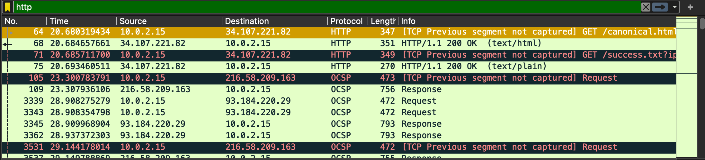
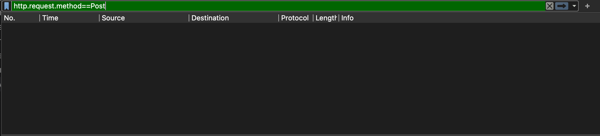
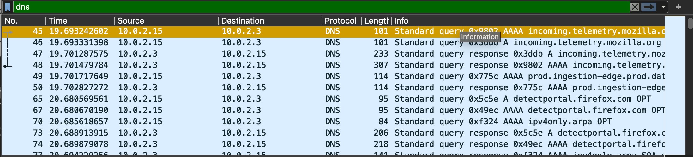
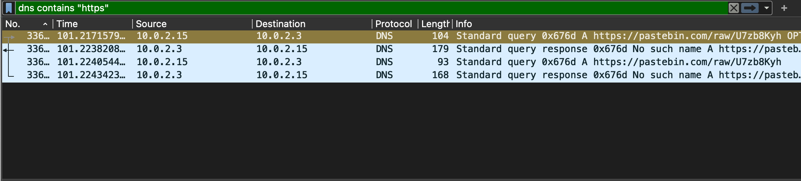
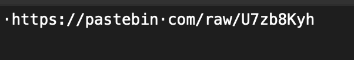
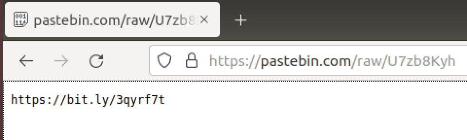
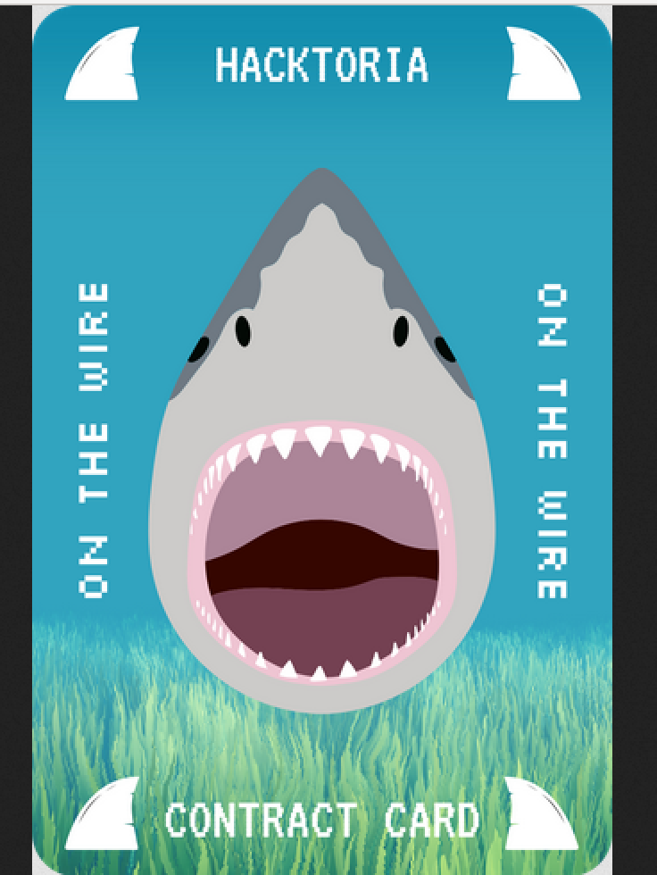

# Hacktoria CTF: On The Wire 
**Difficulty: Medium**

 A corrupt politician's office in Malaysia has been breached. It is revealed that this politician is involved in animal trafficking, particularly shark fin trading and other exotic items. 

 The breach acquired data in the form of anonymous communication using a code name.

 Agent K is tasked with analyzing a packet capture file to find a message: **The contract card.**

# Tool(s)

Wireshark - https://www.wireshark.org/

# Finding the Card

Upon opening the.pcapng file, we are met with tens of thousands of packets of traffic. There are 37.723 traffic, to be exact. It is impossible to inspect all the traffic one by one (well, it's possible, but it's a bit boring to do so).

So, we need to decide the keys (filter) that we're going to use to narrow down our search. 

## First Approach

My initial thought was to search through `HTTP` traffic, which is an unencrypted communication protocol. This means, any text in an HTTP request or response are visible to anyone monitoring the traffic. 

But, there are still quite plenty traffic to inspect.

Let's narrow it down again. 

Since it's a message that leads to the contract card, so it is likely that the http method used will be `POST`. Therefore, let's try `http.request.method==POST`

Well, there's nothing there.

## Second Approach
The attempt with HTTP traffic resulted in nothing. Let's try a different approach. The hint says to find a message that **leads** to the contract card.My best guess that it should be a URL that **leads** to our objective. 

A URL contains domain name. This domain name will be translated into IP Addresses by the `DNS`.

So, let's try filtering using `DNS`.

There are still too much to see here. We need to find another key to reduce the noise. 

Back to the URL. The first part of a URL is the scheme, which indicates the protocol (the language that will be used to communicate between a client browser and the web server). HTTP and HTTPS are the most common ones. Since we've tried with the HTTP, now let's try the HTTPS.

Combining the first key (DNS) and the second key (HTTPS), we get: `dns contains "https"`

Here we see traffic that contains a URL which leads to [Pastebin](https://pastebin.com/). Pastebin itself is an online clipboard to store text online. 

Upon opening the Pastebin link, we can see a shortened URL. 

Let's try opening this URL. Turns out, this is indeed the URL leads us to the contract card

## **MISSION ACCOMPLISHED!**

### More about the Challenge: 
https://hacktoria.com/contracts/on-the-wire/

